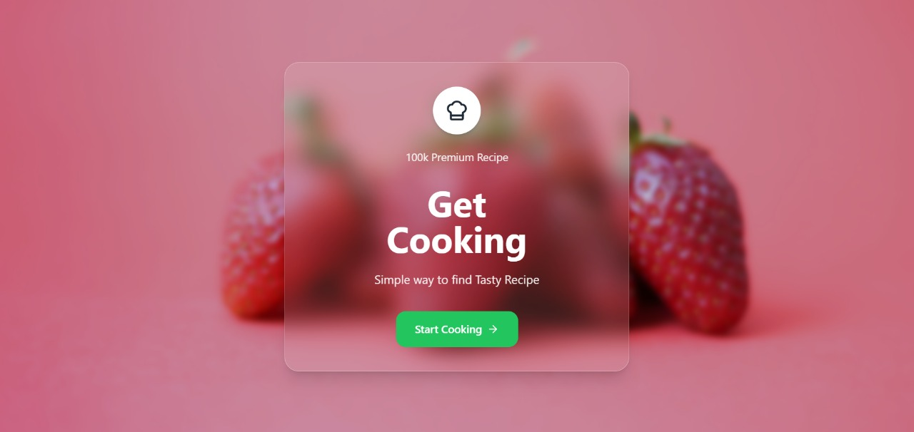
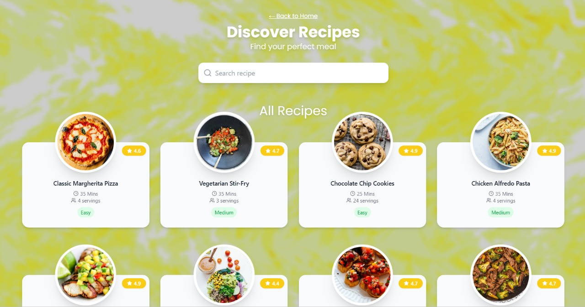
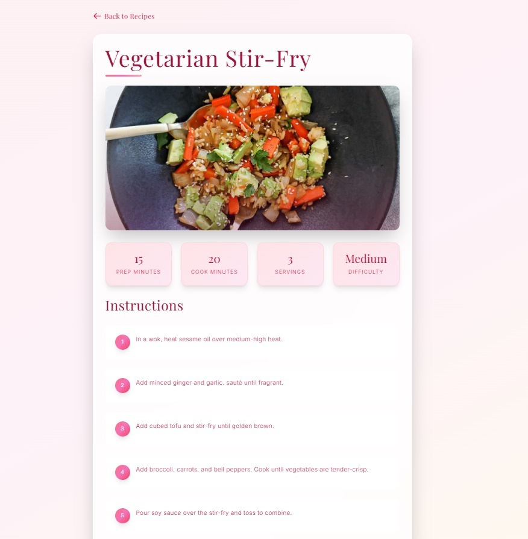

# 🍋 Recipes Explorer

A beautifully animated React + Tailwind web app to explore and discover recipes from a mock API. Featuring a lemony-fresh UI, animated transitions, floating image cards, and a magical search experience.

---

## 🚀 Features

- 🍽️ Dynamic recipe grid UI with animated cards
- 🔎 Live search filtering via `SearchBar`
- ⚡ API data fetched using `useEffect`
- 💅 TailwindCSS utility-first styling
- 🪄 Entry animations with `tailwindcss-animate`
- 🎭 404 handling + graceful loader and error states

---

## 🧠 Tech Stack

- **React** + **TypeScript**
- **Tailwind CSS** with custom fonts
- **React Router** for navigation
- **TailwindCSS Animate Plugin**
- Mock API: [`https://dummyjson.com/recipes`](https://dummyjson.com/recipes)

---

## 🔍 Code Highlight — API Fetch with `useEffect`

```tsx
useEffect(() => {
  const fetchRecipes = async () => {
    try {
      setLoading(true);
      const response = await fetch('https://dummyjson.com/recipes');
      if (!response.ok) throw new Error('Failed to fetch recipes');
      const data: RecipeResponse = await response.json();
      setRecipes(data.recipes);
    } catch (err) {
      setError(err instanceof Error ? err.message : 'An error occurred');
    } finally {
      setLoading(false);
    }
  };

  fetchRecipes();
}, []);
```

This `useEffect` hook runs once when the component mounts and handles API loading, error-catching, and state updates. It's central to loading recipes dynamically.

---

## 📸 Screenshots

### 🏠 Home Page
<p align="center">
  <br/>
  <em>Landing Page</em>
</p>

### 🍲 Recipes Grid
<p align="center">
  <br/>
  <em>Recipe Card Page</em>
</p>

### 📄 Recipe Details
<p align="center">
  <br/>
  <em>Recipe Details Page</em>
</p>


---

## 📁 Folder Structure

```
src/
├── components/
│   ├── RecipesPage.tsx
│   ├── RecipeCard.tsx
│   ├── RecipeGrid.tsx
│   ├── SearchBar.tsx
│   ├── LemonBackground.tsx
│   └── ...
├── types/
│   ├── recipe.ts
│   └── reciperesponse.ts
├── App.tsx
└── main.tsx
```

---

## 📦 Setup Instructions

```bash
git clone https://github.com/your-username/recipes-explorer.git
cd recipes-explorer
npm install
npm run dev
```

---

## 🧑‍💻 Author

Made with 🍋 & ❤️ by **Sanya Shresta**

[](https://github.com/SanyaShresta25)
[](https://www.linkedin.com/in/sanya-shresta-jathanna)
[](https://sanyashresta.netlify.app/)

> UI design, Tailwind CSS animation, routing, and custom image-floating layout ✨
